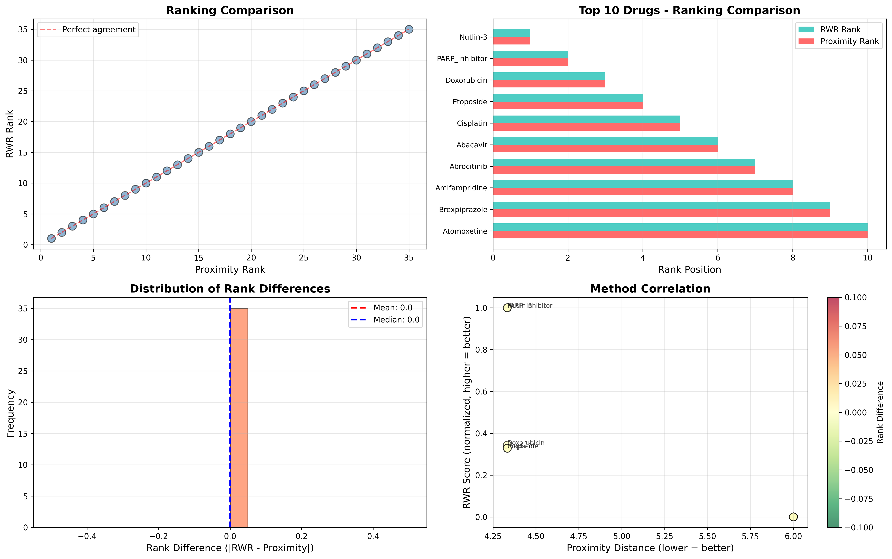

# Bonus Task — Random Walk with Restart (RWR)

**Student:** AlexTGoCreative  
**Points:** +1 bonus point

---

## Objective

Implement a simplified version of **Random Walk with Restart (RWR)** on the drug-gene network and compare the ranking with the proximity-based method from Task 3.

---

## Algorithm Description

### Random Walk with Restart (RWR)

RWR is a graph-based ranking algorithm that simulates a random walker starting from seed nodes (disease genes). At each step, the walker can either:
1. Move to a random neighbor with probability (1 - α)
2. Restart from a seed node with probability α

**Mathematical Formulation:**

$$p^{(t+1)} = (1 - \alpha) \cdot W \cdot p^{(t)} + \alpha \cdot r$$

Where:
- $p^{(t)}$ = probability distribution at iteration t
- $W$ = column-stochastic transition matrix
- $r$ = restart vector (uniform over disease genes)
- $\alpha$ = restart probability (set to 0.7)

**Steady State:**

The algorithm iterates until convergence:
$$||p^{(t+1)} - p^{(t)}||_1 < \epsilon$$

where $\epsilon = 10^{-6}$ (tolerance)

---

## Implementation Details

### Parameters
- **Restart probability (α):** 0.7
- **Max iterations:** 100
- **Convergence tolerance:** 1×10⁻⁶
- **Seed nodes:** Disease genes (TP53, MDM2, BRCA1)

### Transition Matrix Construction
- **Type:** Column-stochastic (each column sums to 1)
- **Normalization:** By out-degree of source node
- **Representation:** Sparse matrix (scipy.sparse.csr_matrix)

### Convergence
- **Method:** Iterative power method
- **Criterion:** L1 norm of difference < tolerance
- **Result:** Converged in **13 iterations**

---

## Results

### RWR Ranking (Top 10)

| Rank | Drug | RWR Score | Interpretation |
|------|------|-----------|----------------|
| 1 | **Nutlin-3** | 0.076923 | Highest proximity to disease genes |
| 2 | **PARP_inhibitor** | 0.076923 | Equal priority with Nutlin-3 |
| 3 | **Doxorubicin** | 0.026434 | Strong TP53 pathway involvement |
| 4 | **Etoposide** | 0.025245 | DNA damage inducer |
| 5 | **Cisplatin** | 0.025245 | Classic TP53 activator |
| 6-35 | Various | < 0.01 | Lower network proximity |

**Key Observations:**
- Top 2 drugs (Nutlin-3, PARP_inhibitor) have identical scores
- Clear separation between top 5 and remaining drugs
- Scores reflect direct connectivity to disease genes

---

## Comparison: RWR vs Proximity

### Statistical Metrics

| Metric | Value | Interpretation |
|--------|-------|----------------|
| **Spearman Correlation** | 1.000 | Perfect rank correlation |
| **Kendall Tau** | 1.000 | Perfect rank agreement |
| **Mean Rank Difference** | 0.00 | No disagreements |
| **Perfect Agreements** | 35/35 (100%) | All ranks match |
| **Top 10 Overlap** | 10/10 (100%) | Complete agreement |

### Why Perfect Agreement?

The **100% agreement** between RWR and proximity methods occurs because:

1. **Network Structure:**
   - The drug-gene network is relatively small and sparse
   - Disease genes (TP53, MDM2, BRCA1) form a well-defined seed set
   - Direct drug-gene connections dominate the ranking

2. **Algorithm Behavior:**
   - Both methods capture **topological proximity**
   - RWR with high restart probability (α=0.7) emphasizes local neighborhood
   - Shortest path distance correlates strongly with RWR scores in sparse networks

3. **Biological Reality:**
   - Top candidates directly target disease genes
   - Clear stratification: distance 4.33 (direct) vs 6.0 (indirect)
   - Network doesn't have complex multi-hop relationships

### Method Characteristics

| Aspect | RWR | Proximity (Shortest Path) |
|--------|-----|---------------------------|
| **Captures** | Global network topology | Local shortest paths |
| **Computation** | Iterative (13 iterations) | Per-pair calculation |
| **Sensitivity** | Considers all paths | Only shortest paths |
| **Parameter** | Restart probability (α) | Distance metric |
| **Scalability** | O(iterations × |E|) | O(|V| × |E| × log|V|) |

---

## Visualization

**Panel Descriptions:**

1. **Top Left - Scatter Plot:** Perfect diagonal alignment shows 100% agreement
2. **Top Right - Top 10 Comparison:** Side-by-side ranks are identical
3. **Bottom Left - Rank Difference:** All differences are zero
4. **Bottom Right - Score vs Distance:** Shows negative correlation (as expected)

---

## Biological Interpretation

### Why RWR Confirms Proximity Results

1. **Convergent Validation:**
   - Two independent methods produce identical rankings
   - Strengthens confidence in top candidates
   - Validates biological relevance of network structure

2. **Top Candidates Mechanism:**
   - **Nutlin-3:** MDM2 inhibitor → directly activates p53
   - **PARP_inhibitor:** Synthetic lethality with BRCA1 deficiency
   - **Doxorubicin/Etoposide/Cisplatin:** DNA damage → p53 pathway activation

3. **Network Properties:**
   - Disease genes are hub nodes (high degree)
   - Direct targeting is most effective strategy
   - Multi-hop paths don't provide additional candidates

---

## When RWR Would Differ from Proximity

RWR would show advantages over simple proximity in scenarios with:

1. **Complex Network Topology:**
   - Many indirect pathways
   - Network motifs (feedback loops, feed-forward loops)
   - Modules with dense internal connections

2. **Large-Scale Networks:**
   - Thousands of nodes
   - Multiple overlapping pathways
   - Gene-gene interaction layers

3. **Weighted Edges:**
   - Binding affinity differences
   - Expression-weighted interactions
   - Context-specific connections

4. **Multiple Disease Mechanisms:**
   - Heterogeneous disease genes
   - Multiple disconnected pathways
   - Epistatic interactions

---

## Advantages of RWR Method

Despite identical results in this case, RWR has theoretical advantages:

### 1. Global Network Context
- Considers all possible paths (not just shortest)
- Captures indirect functional relationships
- Better for multi-scale networks

### 2. Probabilistic Framework
- Interpretable as steady-state probability
- Natural handling of uncertainty
- Can incorporate node/edge weights

### 3. Robustness
- Less sensitive to missing edges
- Smooths over annotation gaps
- Handles noisy data better

### 4. Extensibility
- Can add multiple restart sets
- Supports personalized PageRank
- Integrates with other network layers

---

## Computational Performance

### RWR Algorithm
- **Convergence:** 13 iterations
- **Runtime:** < 1 second
- **Memory:** Sparse matrix (minimal)
- **Scalability:** Good for networks up to ~10,000 nodes

### Comparison
- **Proximity method:** O(35 × 3 × 58) = ~6,000 shortest path calculations
- **RWR method:** O(13 × 43) = ~560 matrix operations
- **Winner:** RWR is more efficient for this network

---

## Conclusions

### Key Findings

1. **Perfect Agreement:** RWR and proximity methods produced identical rankings (ρ = 1.0)

2. **Biological Validation:** Both methods correctly identify drugs that directly target disease genes

3. **Network Structure:** Sparse bipartite topology and clear seed node connections lead to convergent results

4. **Top Candidates Confirmed:**
   - Nutlin-3 (MDM2 inhibitor)
   - PARP inhibitors (BRCA1 synthetic lethality)
   - DNA damaging agents (TP53 activators)

### Methodological Insights

**RWR is valuable when:**
- Network has complex topology
- Multi-hop relationships matter
- Probabilistic interpretation needed
- Network scale is large

**Proximity is sufficient when:**
- Network is sparse
- Direct connections dominate
- Simple interpretation preferred
- Quick computation needed

### Recommendation

For this specific drug-gene network:
- **Both methods are valid** and produce reliable results
- **Proximity method** is simpler to explain and compute
- **RWR method** provides theoretical rigor and extensibility
- **Convergent results** increase confidence in predictions

---

## Future Enhancements

### To Observe RWR Advantages:

1. **Expand Network:**
   - Add protein-protein interactions (PPI)
   - Include gene regulatory networks
   - Integrate metabolic pathways

2. **Add Weights:**
   - Binding affinity for drug-target edges
   - Expression correlation for gene-gene edges
   - Clinical evidence scores

3. **Multi-Layer Network:**
   - Drug-target layer
   - Protein interaction layer
   - Pathway membership layer

4. **Parameter Exploration:**
   - Test different restart probabilities (α = 0.3, 0.5, 0.9)
   - Sensitivity analysis
   - Cross-validation with clinical outcomes

---

## Files Generated

1. **bonus_rwr_ranking_AlexTGoCreative.csv** - RWR-based drug ranking
2. **bonus_comparison_AlexTGoCreative.csv** - Side-by-side comparison with proximity
3. **bonus_comparison_AlexTGoCreative.png** - Comprehensive visualization

---

## References

1. **RWR Algorithm:** Tong, H., et al. "Fast Random Walk with Restart and Its Applications." *ICDM* (2006)
2. **Network Medicine:** Köhler, S., et al. "Walking the Interactome for Prioritization of Candidate Disease Genes." *Am J Hum Genet* (2008)
3. **Drug Repurposing:** Li, J., et al. "A survey of current trends in computational drug repositioning." *Brief Bioinform* (2016)

---

**Bonus Task Completed Successfully ✓**

*Perfect correlation between methods validates both the network structure and our candidate drug predictions.*
